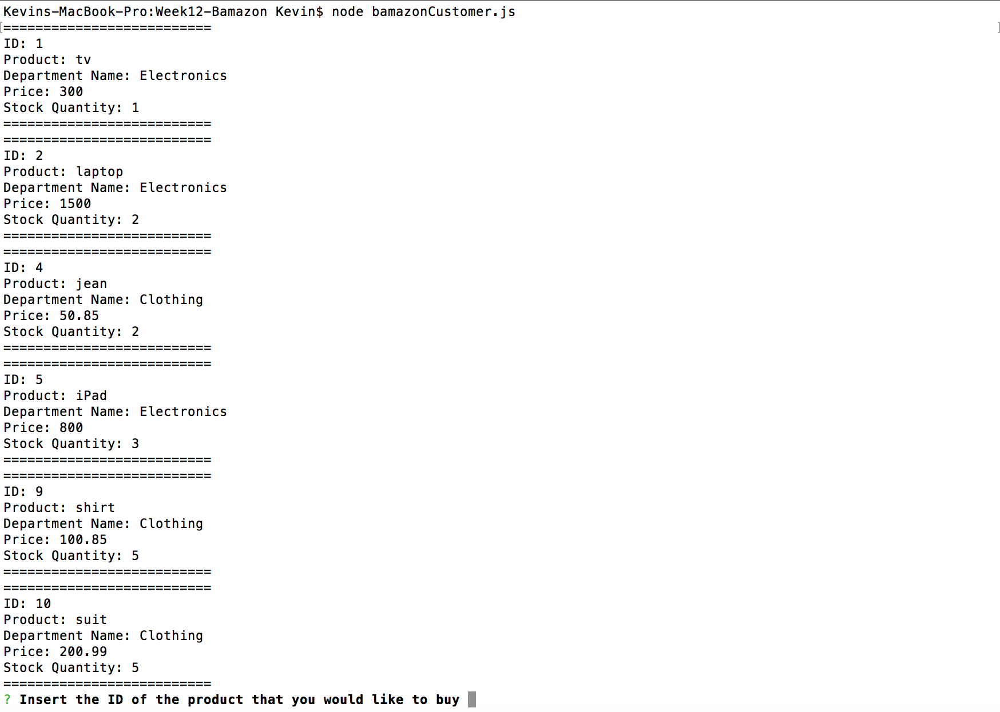

-----------------------------------------
# The Coding Bootcamp at UT Austin

##Week 12 - Bamazon / Using mysql
-----------------------------------------
The purpose of this project is to create a database of products and departments in order to manage stock.

## Screens
#### Table: Products

#### Table: Departments

#### Table: Start of application trough terminal

#### Table: Enough stock

#### Table: Out of stock
